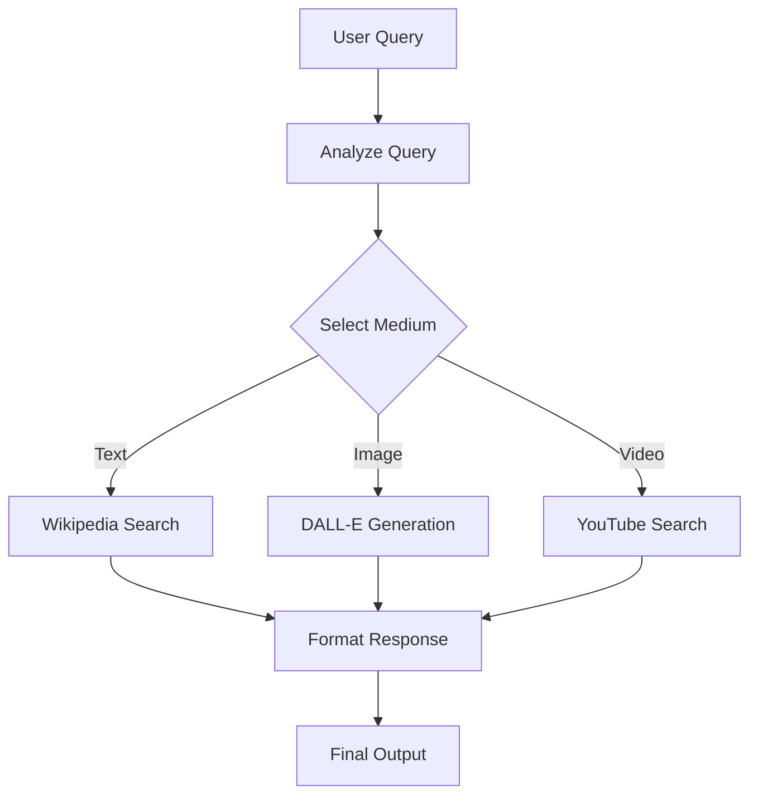

# Chitti - Multi-Modal Topic Explainer Agent

🤖 **Chitti** is an intelligent LangGraph agent that analyzes user queries and provides explanations through the most effective medium: text, image, or video.

## 🌟 Features

- **Intelligent Medium Selection**: Automatically determines whether text, image, or video is best for explaining a topic
- **Multi-Modal Responses**: Integrates Wikipedia, DALL-E, and YouTube search
- **Reasoning-First Approach**: Always explains the rationale before providing the answer
- **LangGraph Architecture**: Built with modern agent workflow patterns
- **Educational Focus**: Optimized for clear, effective learning experiences

## 🏗️ Architecture



## 🚀 Quick Start

### Prerequisites

- Python 3.8+
- OpenAI API key
- Required dependencies (see Installation)

### Installation

```bash
# Clone the repository
git clone <repository-url>
cd chitti-agent

# Install dependencies
pip install langgraph langchain-openai langchain-community openai requests

# Set your OpenAI API key
export OPENAI_API_KEY="your-openai-api-key-here"
```

### Basic Usage

```python
from chitti_agent import ChittiAgent

# Initialize the agent
chitti = ChittiAgent()

# Ask a question
response = chitti.run("How does photosynthesis work?")
print(response)
```

## 📋 Examples

### Text Response Example
```
Query: "The process of photosynthesis"

Reasoning: Since photosynthesis is a scientific process that involves specific chemical reactions and stages, a concise textual explanation will most effectively communicate the information.

Wikipedia Summary:
Photosynthesis is the process by which plants and other organisms convert light energy into chemical energy...
```

### Image Response Example
```
Query: "What does a blue whale look like?"

Reasoning: Since this question asks about the appearance of a blue whale, an image will best show the answer.

Generated Image:

```

### Video Response Example
```
Query: "How to tie a Windsor knot"

Reasoning: Tying a Windsor knot involves sequential movements that are easier to learn by watching. A video tutorial will be the most helpful.

YouTube Videos:
- How to Tie a Windsor Knot - Step by Step Tutorial
- Perfect Windsor Knot in 60 Seconds
```

## 🛠️ Configuration

### Environment Variables

```bash
# Required
OPENAI_API_KEY=your-openai-api-key

# Optional - for enhanced functionality
YOUTUBE_API_KEY=your-youtube-api-key  # For more detailed video search
```

### Customization

You can customize the agent's behavior by modifying:

- **Medium Selection Logic**: Edit the `analyze_query` method
- **Tool Parameters**: Adjust Wikipedia character limits, image sizes, etc.
- **Response Formatting**: Modify the `format_response` method

## 🔧 API Reference

### ChittiAgent Class

#### `__init__()`
Initializes the agent with all required tools and builds the LangGraph workflow.

#### `run(user_query: str) -> str`
Processes a user query and returns a formatted response.

**Parameters:**
- `user_query` (str): The user's question or topic to explain

**Returns:**
- `str`: Formatted response with reasoning and appropriate medium output

### AgentState TypedDict

```python
class AgentState(TypedDict):
    user_query: str
    reasoning: str
    selected_medium: Literal["text", "image", "video"]
    output: str
    messages: List[dict]
```

## 🎯 Medium Selection Criteria

| Medium | Best For | Examples |
|--------|----------|----------|
| **Text** | Definitions, concepts, historical facts, scientific explanations | "What is quantum physics?", "History of Rome" |
| **Image** | Visual appearance, objects, places, visual concepts | "What does Mars look like?", "Show me a Gothic cathedral" |
| **Video** | Processes, tutorials, demonstrations, step-by-step instructions | "How to cook pasta?", "Dance moves tutorial" |

## 🧪 Testing

Run the built-in test examples:

```python
python chitti_agent.py
```

This will test various query types and show the agent's responses.

## 📁 Project Structure

```
chitti-agent/
├── chitti_agent.py      # Main agent implementation
├── README.md            # This file
├── requirements.txt     # Python dependencies
└── examples/
    ├── test_queries.py  # Example usage scripts
    └── demo.ipynb       # Jupyter notebook demo
```

## 🚧 Limitations

- **API Dependencies**: Requires OpenAI API access for both LLM and DALL-E
- **Rate Limits**: Subject to OpenAI API rate limiting
- **Wikipedia Accuracy**: Relies on Wikipedia content quality
- **YouTube Search**: Basic search functionality (can be enhanced with YouTube API)

## 🔮 Future Enhancements

- [ ] Support for additional media types (audio, interactive demos)
- [ ] Enhanced video search with YouTube Data API
- [ ] Caching mechanism for repeated queries
- [ ] Multi-language support
- [ ] Custom knowledge base integration
- [ ] Response quality scoring and improvement

## 🤝 Contributing

1. Fork the repository
2. Create a feature branch (`git checkout -b feature/amazing-feature`)
3. Commit your changes (`git commit -m 'Add amazing feature'`)
4. Push to the branch (`git push origin feature/amazing-feature`)
5. Open a Pull Request

## 📄 License

This project is licensed under the MIT License - see the [LICENSE](LICENSE) file for details.

## 🙏 Acknowledgments

- **LangGraph**: For the excellent agent framework
- **OpenAI**: For GPT-4 and DALL-E APIs
- **LangChain**: For tool integrations and utilities
- **Wikipedia**: For providing free educational content

## 📞 Support

If you encounter any issues or have questions:

1. Check the [Issues](../../issues) page
2. Review the [Discussions](../../discussions) section
3. Contact the maintainers

---

**Made with ❤️ by the Chitti Development Team**

*Chitti: Making knowledge accessible through the perfect medium.*